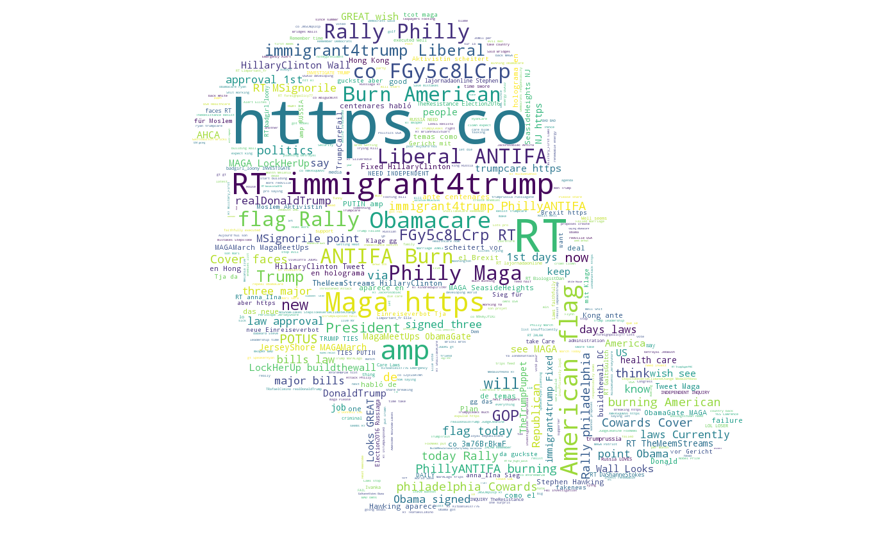
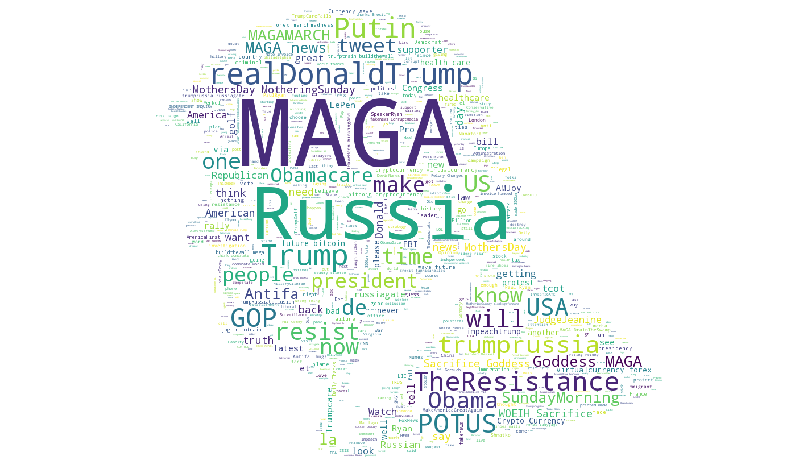

# Twitter API Hashtag Investigation

Now that we can successfully log into twitter through tweepy, it may be good to investigate what type of data we will be dealing with. Having followed the trump presidency considerably recently let's investigate what a typical data pull would look like.

First lets set up the api.


```python
import keys
import tweepy
from pprint import pprint
consumer_key = keys.CONSUMER_KEY
consumer_secret = keys.CONSUMER_SECRET
access_token = keys.ACCESS_TOKEN
access_token_secret = keys.ACCESS_TOKEN_SECRET
auth = tweepy.OAuthHandler(consumer_key, consumer_secret)
auth.set_access_token(access_token, access_token_secret)
api = tweepy.API(auth)
```

Now lets search for the trending `#trump` tweets.


```python
tweets = api.search('#trump')

for i, tweet in enumerate(tweets):
    print(i+1, tweet.text)
```

    1 Gesundheitsgesetz gescheitert: #Trump will sich Steuerreform zuwenden https://t.co/y6VMyH3nNs https://t.co/VejyJKKWcQ
    2 RT @Bonn1eGreer: #Trump is the kind of guy who hates to lose. Watch his next move. It'll either be a web of lies..or worse
    #TheCloser
    https…
    3 @LToddWood He didn't have the votes just with #Republicans so why are the #Democrats being blamed? #TRUMP made a threat + they didn't flinch
    4 RT @foreignpolicy77: Lots of pro #Trump saying #obamacare is STILL #Democrats responsibilty. Hows that work? Is redville USA going to doubl…
    5 @GeorgeTakei #trump expects to get his way w/ women,busines,politics via shame &amp; aggression. We just elected… https://t.co/V1WgGfXpeU
    6 Legislating is harder than Republicans thought: BBC News - How disastrous for Trump is healthcare collapse? https://t.co/pljWcu2ZkN #Trump
    7 RT @foreignpolicy77: Lots of pro #Trump saying #obamacare is STILL #Democrats responsibilty. Hows that work? Is redville USA going to doubl…
    8 RT @LetKiser: Zivile Opfer in Syrien:#Trump bat um "Veränderungen bei allen Beschränkungen, die über das Völkerrechts hinausgehen"
    https://…
    9 RT @anna_IIna: Sieg für #Trump: Moslem-Aktivistin scheitert vor Gericht mit Klage gg das neue Einreiseverbot. Tja, da guckste aber. https:/…
    10 RT @SupportDonald: #BREAKING: #Liberal #Media Busted Citing FAKE Anti-#Trump POLL Funded By #GeorgeSoros - #FakeNews #Soros 
    #MAGA🇺🇸 https:…
    11 RT @TEN_GOP: Happy 11th Birthday Barron Trump! America♥️you.
    #MAGA #TrumpTrain #ComeyHearing #Trump https://t.co/qGvgVQTUq3
    12 RT @fixit_fitz: While everyone was distracted by healthcare #trump managed to pass anti-privacy, anti-epa and anti-civil-rights legislation…
    13 RT @immigrant4trump: I Fixed @HillaryClinton Tweet 👍👍 #Maga #Trump https://t.co/3m76BrBkmF
    14 RT @davidicke: Trump has authority to issue revised travel ban, Virginia judge rules https://t.co/BvjRpPeDls #Trump https://t.co/WcBAk9LfNw
    15 Someone had a lot of money invested in #trump? And a lotta lotta people think Fox, Breitbart and alt-right are prod… https://t.co/d2K6sB7yBG


It looks like the number of tweets is only15 using the tweepy search function. This is due to pagination and each api call can only grab 15 tweets at a time. Looking at the [tweepy Cursor tutorial](https://github.com/tweepy/tweepy/blob/master/docs/cursor_tutorial.rst) reveals that you can request tweets by the page based on the required number of tweets. Let's grab the top 1000 tweets and dump them into a pickle file for further processing.


```python
import pickle
trump_statuses = [status for status in tweepy.Cursor(api.search, '#trump').items(1000)]
pickle.dump(trump_statuses, open('pickle_dumps/trump_statuses.p', 'wb'))
print("Saved!")
```

    Saved!


Now that we have our tweets locally we can start tearing them apart. Let's have some fun first and create a word cloud to see what we're dealing with. There seems to be a great option on pip called 'wordcloud' found [here](https://github.com/amueller/word_cloud). We'll install that and see what we can produce!


```python
%%capture
from PIL import Image
import numpy as np
import pickle
from wordcloud import WordCloud, STOPWORDS

trump_statuses = pickle.load(open('pickle_dumps/trump_statuses.p', 'rb'))
text_dump = [status.text.strip() for status in trump_statuses]
text_dump = ' '.join(text_dump)

# We'll make the words into a sillhoute of trump for some fun
# Found at https://projects.propublica.org/trump-conflicts/
trump_mask = np.array(Image.open("wordcloud/trump_mask.png"))

stopwords = set(STOPWORDS)
stopwords.add('Trump')

wc = WordCloud(background_color="white", max_words=2000, mask=trump_mask,
               stopwords=stopwords)

# generate word cloud
wc.generate(text_dump)

# store to file
wc.to_file("images/trump.png")
```


There are quite a few words that are very relevant to Trump news, however, things like https and co signify that there's some cleaning up to do. Furthermore, some of these tweets may be retweets. Let's see the top tweets based on retweets.


```python
import pickle
from pprint import pprint

trump_statuses = pickle.load(open('pickle_dumps/trump_statuses.p', 'rb'))
simplified_statuses = [(str(ts.retweet_count) + " retweets", 
                        str(ts.favorite_count) + " favorites.", 
                        ts.text, 
                        "Has retweeted_status" if 'retweeted_status' in dir(ts) else "No retweeted_status")
                            for ts in trump_statuses]
retweet_sorted = sorted(simplified_statuses, key=lambda x: x[0], reverse=True)
favorite_sorted = sorted(simplified_statuses, key=lambda x: x[1], reverse=True)
pprint(retweet_sorted[:2])
pprint(favorite_sorted[:2])
```

    [('998 retweets',
      '0 favorites.',
      'RT @BiologistDan: In last 5 years 7 million gallons of oil have leaked from '
      "3300 pipelines. #Trump doesn't t care, he just approved Keyston…",
      'Has retweeted_status'),
     ('983 retweets',
      '0 favorites.',
      'RT @TrumpyLeaks: So much winning! 😂😂😂 #obamacare #trump #ryan #trumpcare '
      'https://t.co/i2ycZa47wh',
      'Has retweeted_status')]
    [('0 retweets',
      '50 favorites.',
      'https://t.co/NCpRoUufgS\n\n#TRUMPTRAIN #potus #trump',
      'No retweeted_status'),
     ('2 retweets',
      '5 favorites.',
      'Sign the petition: Tell @SenateDems to protect our consumer protection '
      'agency from #Trump  https://t.co/gu9jOzYTZm… https://t.co/eU85CNLQk0',
      'No retweeted_status')]


Looking at the above tweets a few things immediately stick out.

* Many tweets are truncated (starting with https://t.co) inside the tweets. This explains why https and co were some of the larger words in the map.
* Some tweets are truncated, ending with elipses. 
* Retweets begin with RT, which was one of the other larger words in the word map.
* If a tweet is retweeted it will have a retweeted_status

Let's investigate how many of these tweets are not retweets.


```python
print("Number of total tweets:", len(retweet_statuses))
non_retweeted = [ts for ts in trump_statuses if 'retweeted_status' not in dir(ts)]
print("Number of non-retweets:", len(non_retweeted))
```

    Number of total tweets: 1000
    Number of non-retweets: 374


Alright then, looks like there's only 374 original tweets. That's a lot of retweets, and in many cases these will end with ellipses. Let's try to convert these retweets to the original tweet.


```python
original_tweets = [t.retweeted_status  if 'retweeted_status' in dir(t) else t
                       for t in trump_statuses]
simplified_original_statuses = [(str(ts.retweet_count) + " retweets", 
                                 str(ts.favorite_count) + " favorites.", 
                                 ts.text, 
                                 "Truncated" if ts.truncated else "Not truncated")
                                     for ts in original_tweets]
retweet_sorted = sorted(simplified_original_statuses, key=lambda x: x[0], reverse=True)
favorite_sorted = sorted(simplified_original_statuses, key=lambda x: x[1], reverse=True)
pprint(retweet_sorted[:2])
pprint(favorite_sorted[:2])
```

    [('998 retweets',
      '721 favorites.',
      'In last 5 years 7 million gallons of oil have leaked from 3300 pipelines. '
      "#Trump doesn't t care, he just approved K… https://t.co/URMKJNrbpV",
      'Truncated'),
     ('983 retweets',
      '1549 favorites.',
      'So much winning! 😂😂😂 #obamacare #trump #ryan #trumpcare '
      'https://t.co/i2ycZa47wh',
      'Not truncated')]
    [('928 retweets',
      '993 favorites.',
      '#Trump Trashers Mocked The Literal Meaning Of The #Obama #Wiretap Tweet \n'
      '\n'
      'While Concealing That #Obama Did Conduct… https://t.co/hEEqxz9tTR',
      'Truncated'),
     ('50 retweets',
      '96 favorites.',
      'Today marks the longest time a Russian spy has been President of the United '
      'States. \n'
      '\n'
      '#TRUMP \n'
      '#trumprussia',
      'Not truncated')]


It looks like the tweets are still truncated, followed by a link to the original tweet. This is to keep the tweet under 140 characters, as per Twitter's rules. To fix this we can try using tweet_mode=extended [from the documentation](https://dev.twitter.com/overview/api/upcoming-changes-to-tweets).


```python
for tweet in original_tweets:
    if tweet.truncated:
        truncated_tweet = tweet
        break
print("Truncated tweet message:", truncated_tweet.text)
full_text_status = api.get_status(truncated_tweet.id, tweet_mode='extended')
print("Full tweet message:", full_text_status.full_text)
print([s for s in dir(full_text_status) if not s.startswith('_')])
```

    Truncated tweet message: #Trump #Maga #Trump2020 #MakeAmericaGreatAgain #FuckLiberal #FuckTheLeft #Sshumer #NancyPelosi just bigger assholes… https://t.co/BvW3HUZJG3
    Full tweet message: #Trump #Maga #Trump2020 #MakeAmericaGreatAgain #FuckLiberal #FuckTheLeft #Sshumer #NancyPelosi just bigger assholes driving America Down https://t.co/1ywjyUzHNE
    ['author', 'contributors', 'coordinates', 'created_at', 'destroy', 'display_text_range', 'entities', 'favorite', 'favorite_count', 'favorited', 'full_text', 'geo', 'id', 'id_str', 'in_reply_to_screen_name', 'in_reply_to_status_id', 'in_reply_to_status_id_str', 'in_reply_to_user_id', 'in_reply_to_user_id_str', 'is_quote_status', 'lang', 'parse', 'parse_list', 'place', 'possibly_sensitive', 'possibly_sensitive_appealable', 'quoted_status', 'quoted_status_id', 'quoted_status_id_str', 'retweet', 'retweet_count', 'retweeted', 'retweets', 'source', 'source_url', 'truncated', 'user']


Perfect! Now we can have full, non-truncated tweets. Let's obtain 1000 full tweets this time and remove any truncation. We'll also filter for english only tweets.


```python
import pickle
full_trump_statuses = [status for status in tweepy.Cursor(api.search, '#trump', tweet_mode='extended', languages=["en"]).items(1000)]
pickle.dump(full_trump_statuses, open('pickle_dumps/full_trump_statuses.p', 'wb'))
print("Saved!")
```

    Saved!


Let's load up our tweets and ensure they all contain the 'full_text' attribute.


```python
import pickle
from pprint import pprint

# Get all tweets
full_trump_statuses = pickle.load(open('pickle_dumps/full_trump_statuses.p', 'rb'))
# Convert retweets to original tweet
original_full_tweets = [t.retweeted_status  if 'retweeted_status' in dir(t) else t
                           for t in full_trump_statuses]

# Clean tweetss
used_tweets = set()
full_tweet_text = []
for tweet in original_full_tweets:
    if tweet.id not in used_tweets:
        used_tweets.add(tweet.id)
        # Obtain text and remove urls
        cleaned_tweet = re.sub("http\S+", "", tweet.full_text)
        full_tweet_text.append(cleaned_tweet)

print("Url free:", full_tweet_text[:3])
```

    Url free: ['#Trump agenda will.. |#GOP #Potus #MakeAmericaGreatAgain #TrumpPolls @realDonaldTrump #TrumpTrain', '#Trump plays 3-D chess- World & GOP/DEM #establishment checkers. Next move- watch! #Throwback #BenGarrison Cartoon  ', "Don't reckon much to @BBCNews  #Trump tribute act..... "]


We now have 1000 original tweets without any urls! Let's try to create another wordmap.


```python
%%capture
from PIL import Image
import numpy as np
import pickle
from wordcloud import WordCloud, STOPWORDS

cleaner_text_dump = ' '.join(url_free_text)

# We'll make the words into a sillhoute of trump for some fun
# Found at https://projects.propublica.org/trump-conflicts/
trump_mask = np.array(Image.open("wordcloud/trump_mask.png"))

stopwords = set(STOPWORDS)
stopwords.add('Trump')
stopwords.add('amp')
stopwords.add('rt')

wc = WordCloud(background_color="white", max_words=2000, mask=trump_mask,
               stopwords=stopwords)

# generate word cloud
wc.generate(cleaner_text_dump)

# store to file
wc.to_file("images/trump_url_free.png")
```

Now that the wordcloud is saved, let's see what we have.


Now it appears we have many key hashtags such as MAGA (make America great again), Russia (many ties with Trump and Russia at the moment, March 27th) and various other related key words. Of course, if you run the code above and generate your own image you'll create a word cloud entirely your own! Now that we gathered the keywords from the tweets, it's time to begin the (much more difficult) task of finding the key **points** that are found in these tweets.
